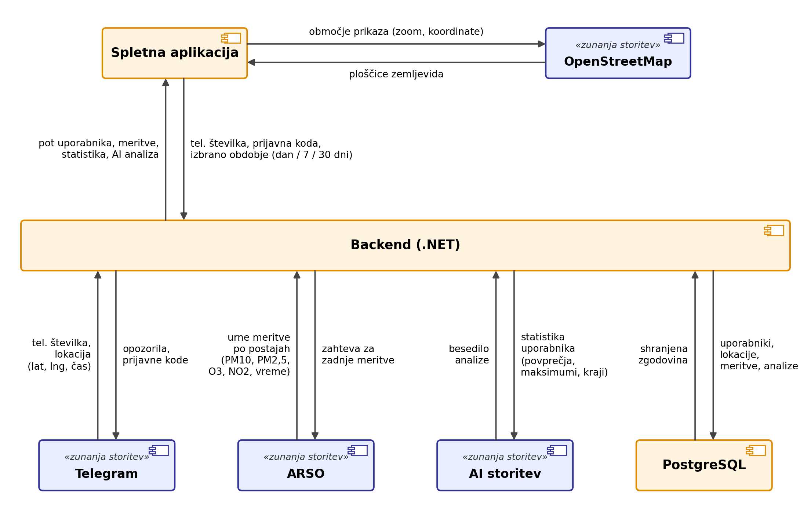

# zrak-sled

Projekt pri predmetu Tehnologije integracije in digitalizacije storitev (FERI, UM).

Aplikacija ti pokaže, kakšen zrak si dihal tam, kjer si se gibal. ARSO sicer objavlja meritve kakovosti zraka, ampak samo po merilnih mestih in samo za trenutno stanje. Mene je zanimalo, kako bi to povezal s tem, kje sem bil čez dan oziroma čez teden.

Uporabnik se registrira prek Telegram bota s telefonsko številko in deli lokacijo v živo. Sistem vsako uro pobere meritve z ARSO, jih poveže z njegovimi lokacijami in ga v Telegramu opozori, če je zrak v bližini slab. Na spletni strani (prijava z isto številko, koda pride v Telegram) vidi zemljevid svoje poti, obarvan glede na onesnaženost, pregled za zadnjih 7 in 30 dni in kratko AI analizo.

Izpolnjen obrazec z idejo: [docs/Obrazec.pdf](docs/Obrazec.pdf)

## Funkcionalnosti

- registracija prek Telegrama s telefonsko številko
- deljenje lokacije v živo in shranjevanje poti
- urni prevzem meritev zraka in vremena z ARSO
- opozorila v Telegramu, ko so vrednosti nad mejo
- prijava na spletu brez gesla (koda pride v Telegram)
- zemljevid poti z drsnikom po dnevih in urah
- statistika za 7 in 30 dni ter AI analiza

## Arhitektura



Zunanje storitve med sabo niso povezane, vse gre prek backenda. Ta sprejema podatke iz Telegrama, vsako uro kliče ARSO, shranjuje v bazo, računa statistiko, kliče Gemini in vse skupaj prek REST API-ja ponuja spletni aplikaciji.

## Storitve

| Storitev | Vloga | Oblika | Dokumentacija |
|---|---|---|---|
| Telegram Bot API | registracija, lokacija, opozorila, prijavne kode | HTTPS, JSON | [core.telegram.org/bots/api](https://core.telegram.org/bots/api) |
| ARSO | urne meritve zraka in vremena po postajah | HTTP GET, XML | [arso.gov.si/zrak](https://www.arso.gov.si/zrak/), [meteo.arso.gov.si](https://meteo.arso.gov.si) |
| Google Gemini | analiza statistike v naravnem jeziku | HTTPS POST, JSON | [ai.google.dev/gemini-api/docs](https://ai.google.dev/gemini-api/docs) |
| OpenStreetMap + Leaflet | zemljevid, pot in merilna mesta | HTTPS GET, PNG | [leafletjs.com](https://leafletjs.com/reference.html) |

## Podatki, ki se prenašajo

- **Telegram → backend** (JSON): ob registraciji `phone_number` (string) in `user_id` (int), potem lokacija `latitude`, `longitude` (float) s časom `date` (Unix timestamp). Lokacijo shranim samo, če sta minili vsaj 2 minuti ali se je uporabnik premaknil za več kot 100 m.
- **Backend → Telegram** (JSON, `sendMessage`): opozorila o slabem zraku in prijavne kode (6 številk, veljajo 5 min).
- **ARSO → backend** (XML): za vsako postajo ime, čas meritve in vrednosti PM10, PM2,5, O3, NO2 v µg/m³, pri vremenu pa temperatura, vlaga, veter in padavine. ARSO hrani samo zadnje stanje, zato zgodovino shranjujem sam.
- **Backend → Gemini** (JSON): že izračunana statistika uporabnika (povprečja, maksimumi, ure nad mejo, kraji). AI nič ne računa, samo razloži številke.
- **Gemini → backend** (JSON): besedilo analize v slovenščini, ki ga shranim, da AI ne kličem ob vsakem osveževanju.
- **Spletna aplikacija ↔ backend** (JSON, moj REST API): aplikacija pošlje številko, kodo in obdobje, nazaj dobi pot (točke z vrednostjo z najbližje postaje), meritve postaj, statistiko in AI analizo.
- **Spletna aplikacija ↔ OpenStreetMap**: zahteva po zoomu in koordinatah, nazaj ploščice (PNG).

## Tehnologije

- **Backend:** .NET (ASP.NET Core, EF Core)
- **Baza:** PostgreSQL
- **Frontend:** React + Leaflet
- **Bot:** Telegram.Bot
- **AI:** Google Gemini
- **Zagon:** Docker, docker-compose

## Struktura repozitorija

```
airtrace/
├── src/
│   ├── Airtrace.Api/       REST API in prijava
│   ├── Airtrace.Worker/    Telegram bot, prevzem meritev, opozorila
│   ├── Airtrace.Core/      logika (izpostavljenost, statistika)
│   └── Airtrace.Data/      baza, EF Core migracije
├── web/                    spletna aplikacija
├── tests/
├── docs/                   obrazec in diagrami
├── docker-compose.yml
└── .env.example
```

## Zagon

1. `.env.example` kopiraj v `.env` in vpiši `TELEGRAM_TOKEN` (dobiš pri @BotFather), `GEMINI_API_KEY` (Google AI Studio) in `DB_PASS`.
2. Zaženi `docker compose up --build`.
3. Spletna aplikacija teče na `http://localhost:8080`.

`.env` ne gre na GitHub.

## Omejitve

Vrednost zraka je vzeta z najbližje ARSO postaje, ne točno z mesta, kjer je bil uporabnik, zato je to ocena. Pot obstaja samo za čas, ko uporabnik deli lokacijo v živo.
